<h1>Portfolio site</h1>

Dale Thompson - September 2019

<h2>  <a href = "http://www.sillygoosemobile.com">Visit my portfolio</a></h2>
  
or

<h2>  <a href = "/DBThompson713.github.io">visit on github</a></h2>

<h2>Tech Stack</h2>
<ul>
<li>HTML</li>
<li>CSS</li>
<li>Javascript</li>
<li>Jquery</li>
</ul>

  

<strong><h2>Purpose</h2></strong>

The purpose of this portfolio is to show some basic information and details about myself as well as display a bit of coding.

I wanted to try doing something a little different, even if it meant a bit of extra headaches for myself. I wanted to play with an atypical interface.

 I wanted to show case a few projects I had previously completed, as well as show some photos.

<strong><h2>Functionality / features</h2></strong>

Rather than a traditional nav bar, I wanted to try something that I hadn't really seen before. I decided to try a side nav bar. I also decided on utilizing animations on the main page.

I decided to display photos in the gallery section in a unique way. I wanted the blog and projects sections to be controllable with swipe

<h4>Target Audience</h4>
<ul>
<li>Instructors and staff at Coder Academy</li>
<li>People looking to potentially hire devs</li>
<li>people keen to see a weird UI</li>
</ul>

<h3>Features</h3>

<strong>Animated side nav bar</strong>

   
 The nav bar is located on the right hand side. the text is written bottom to top, left to right. Upon clicking a the side links, they swing out at a 90 degree angle so that the font is the right way.
   <ul>
   <li>clicking a new side bar heading will cause the intially clicked out to swing back in, so that one one menu is "swung out" at any time.</li>
   <li>This is accomplished by having jquery listen for a click on any of the side links and applying a class which hass a css animation to "swing" the nav heading out</li>
   <li>the menu headings are closed by removing the swingout class from the unwanted "swingers"</li>
   </ul>

<strong>Animated secondary menu</strong>

   
 Once the "swinger" side link is swung out, a secondary menu slides and fades in under the heading
   <ul>
   <li>clicking the heading will cause the sub menu to slide up and fade out</li>
   <li>This is accomplished by having jquery apply and remove styles to the sub menu based on the swinger .swingout class previously applied</li>
   <li>the menu headings are closed by removing the swingout class from the unwanted "swingers"</li>
   </ul>

<strong>Shader for background</strong>

 I opted for a bright background and wanted white font, this can make readability an issue. I solved this by having a shader applied to the background
   <ul>
   <li>Whenever text is visible on the main screen, a .shaded class is applied to the body covering container "shader</li>
   <li>This is accomplised by having jquery apply the shaded class based on certain criteria.</li>
   </ul>

<strong>Touch control for gallery and project sections</strong>

 the gallery and project sections have been optimised for touch input.
   <ul>
   <li>The seperate pages are accessible by swiping down. The page will scroll to exactly the next card</li>
   <li>This is accomplised by making use of the swiper api</li>
   </ul>

<strong>Sydney section parallax and touch controls</strong>

The gallery section makes use of a parallax effect for a short story while slideing left and right to display a panaramic shot of sydney harbour
   <ul>
   <li>Makes use of swiper api</li>
   <li>utilizes the swiper parallax timing effects</li>
   </ul>

<h1>Screenshots</h1>

<h2>Main Page</h2>

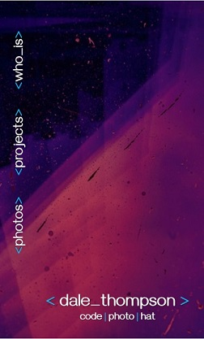

<h2>Menu folded out</h2>

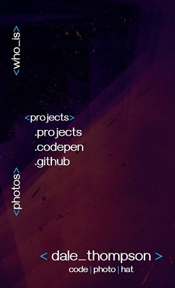

<h2>Projects Section</h2>

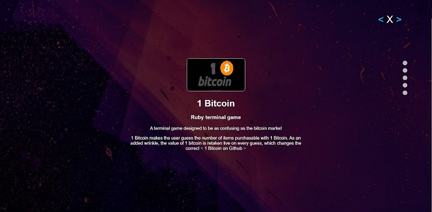

<h2>Main page contact section</h2>

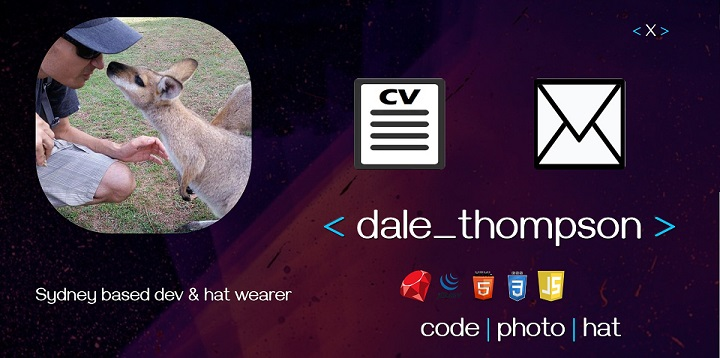
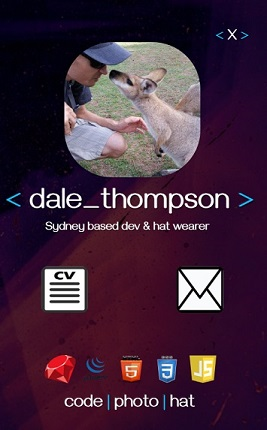

<h2>Gallery Section</h2>

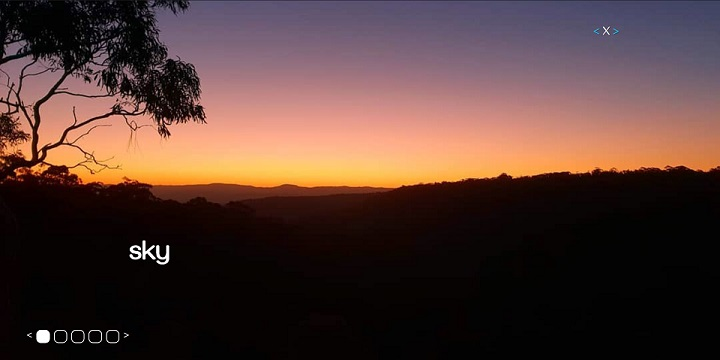
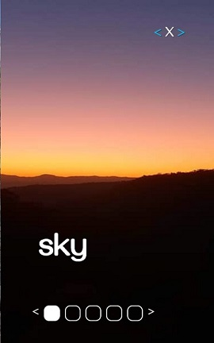

<h2>Photo feature section</h2>

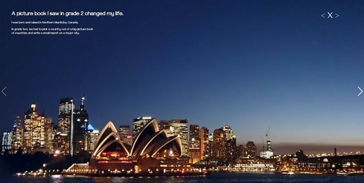
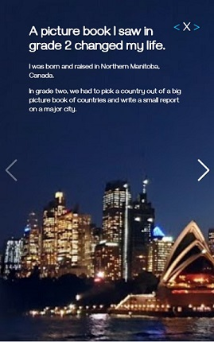

 

<h2>Site Map</h2>

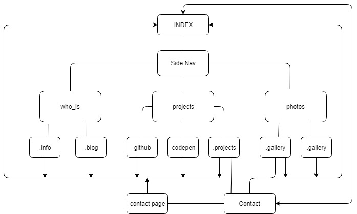
 

<h2>Wireframes</h2>
 

<h1>Initial designs</h1>
<h2>Main Page</h2>

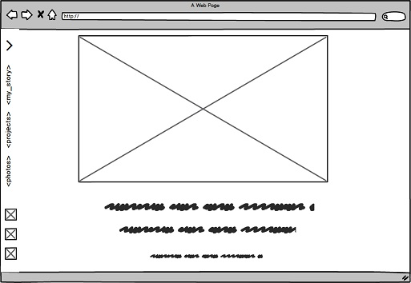
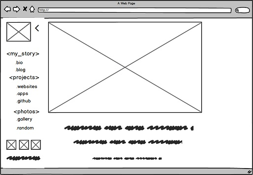
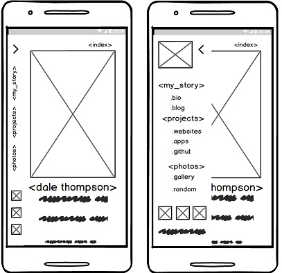

<h1>Updated design</h1>

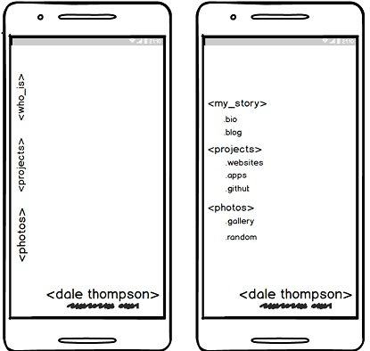
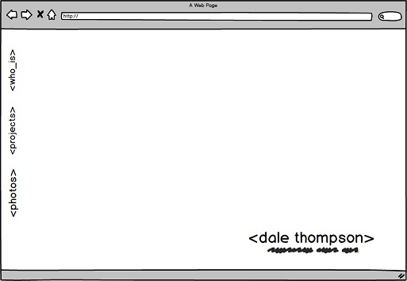

<h2>Bio gallery and blog</h2>

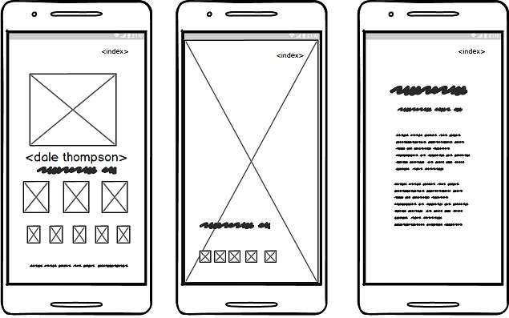
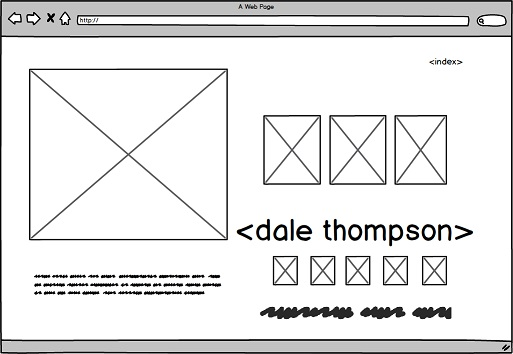
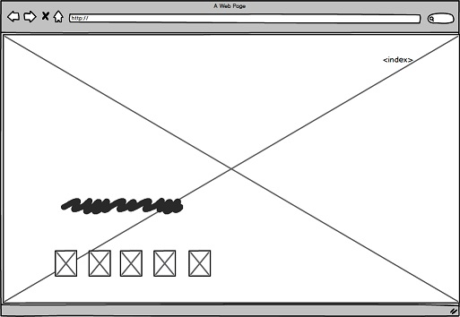
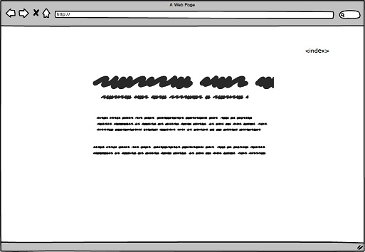

<h2>Projects Sydney feature contact page</h2>

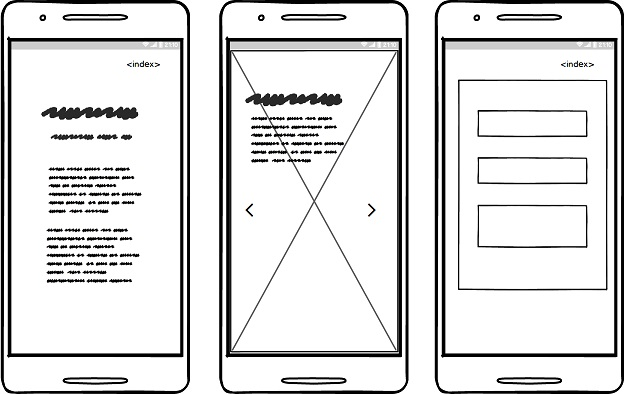

 

Dale Thompson - September 2019 - Coderacademy Sydney
